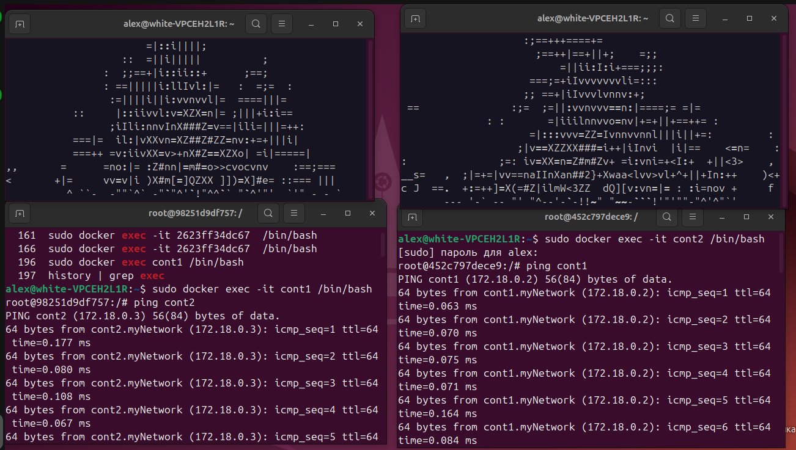

# Лабораторная работа 4.

Создала docker image (образ). Для этого написала Dockerfile. Создала пустой текстовый документ, где указываем образ, на основе которого будет работать наш. 
```
FROM ubuntu:latest
RUN apt-get update && apt-get install -y libaa-bin
```
В терминале в папке с этим файлом запускаем команду сборки образа с тегом “aafire”.
```
sudo docker build -t aafire .
```
Далее запускаем контейнер на основе созданного образа. При создании контейнера передаём ему запуск приложения “aafire”.
```
sudo docker run -it aafire /usr/bin/aafire
```
Результат работы:

<p align="center">
 
</p>

Далее добавляем в файл Dockerfile установку утилиты:
```
FROM ubuntu:latest
RUN apt-get update && apt-get install -y libaa-bin iputils-ping
```
и создаем новый образ `affire-ping`
```
sudo docker build -t affire-ping .
```
Далее запускаем контейнер на основе созданного образа. При создании контейнера передаём ему запуск приложения “aafire”.
```
sudo docker run -it aafire-ping /usr/bin/aafire
```
На основе образа `aafire-ping` создаем и запускаем контейнеры с именами `cont1` и `cont2`:
```
sudo docker run -it --name cont1 aafire-ping /usr/bin/aafire
```
```
sudo docker run -it --name cont2 aafire-ping /usr/bin/aafire
```
С помощью команды `sudo docker ps` убеждаемся, что оба контейнера запущены:
<p align="center">
 
</p>

С помощью команды `sudo docker network create myNetwork` создала сеть:
<p align="center">
 
</p>

После этого подключила контейнеры к сети.
```
docker network connect myNetwork cont1
docker network connect myNetwork cont2
```
Теперь при помощи команды `docker network inspect myNetwork` посмотрим настройки созданной сети.
<p align="center">
 
</p>

Теперь в отдельных окнах с помощью следующих команд подключимся непосредственно к контейнерам и проверим связь между ними:
```
sudo docker exec -it cont1 /bin/bash
ping cont2
```
```
sudo docker exec -it cont2 /bin/bash
ping cont1
```

И увидим результат работы:
<p align="center">
 
</p>

