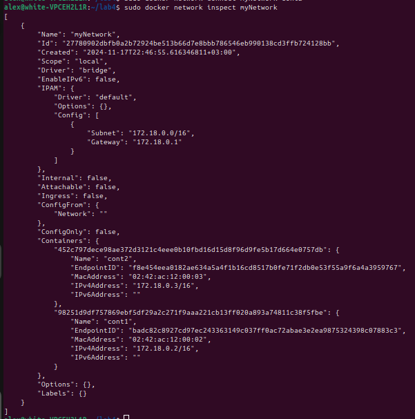

# Лабораторная работа 4.

Создала docker image (образ). Для этого написала Dockerfile. Создала пустой текстовый документ, где указываем образ, на основе которого будет работать наш. 
```
FROM ubuntu:latest
RUN apt-get update && apt-get install -y libaa-bin
```
В терминале в папке с этим файлом запускаем команду сборки образа с тегом “aafire”.
```
sudo docker build -t aafire .
```
Далее запускаем контейнер на основе созданного образа. При создании контейнера передаём ему запуск приложения “aafire”.
```
sudo docker run -it aafire /usr/bin/aafire
```
Результат работы:

<p align="center">
 
</p>

Далее добавляем в файл Dockerfile установку утилиты:
```
FROM ubuntu:latest
RUN apt-get update && apt-get install -y libaa-bin iputils-ping
```
и создаем новый образ `affire-ping`
```
sudo docker build -t affire-ping .
```
Далее запускаем контейнер на основе созданного образа. При создании контейнера передаём ему запуск приложения “aafire”.
```
sudo docker run -it aafire-ping /usr/bin/aafire
```
На основе образа `aafire-ping` создаем контейнеры с именами `cont1` и `cont2`:
```
sudo docker run -it --name cont1 aafire-ping /usr/bin/aafire
```
```
sudo docker run -it --name cont2 aafire-ping /usr/bin/aafire
```
С помощью команды `sudo docker ps` убеждаемся, что оба контейнера запущены:
<p align="center">
 
</p>

С помощью команды `sudo docker network create myNetwork` создала сеть:
<p align="center">
 
</p>

После этого подключила контейнеры к сети.
```
docker network connect myNetwork cont1
docker network connect myNetwork cont2
```
Теперь при помощи команды `docker network inspect myNetwork` посмотрим настройки созданной сети.
<p align="center">
 
</p>

## Задание:  
Запустить в контейнере приложение “aafire”. Обратите внимание, что оно бесконечное и контейнер не будет автоматически отключаться.  
Приложить скриншот в процессе работы контейнера.  

Далее в рамках лабораторной работы необходимо самостоятельно настроить сеть между двумя контейнерами, также как в предыдущей работе вы настраивали связь между двумя виртуальными машинами.  

Для проверки сети между контейнерами вам потребуется утилита ping. Поскольку контейнеры очень маленькие и в них нет ничего лишнего (по сравнению с виртуальными машинами) - ping там не установлен. В вашем образе нужно будет установить пакет с этой утилитой, помимо aafire.  

Далее запустите два контейнера с aafire и оставьте их в работающем состоянии.  
Откройте ещё одно окно терминала и создайте сеть при помощи команды 
```
docker network create myNetwork
```
После этого нужно будет подключить контейнеры к вашей сети. Названия контейнеров можно увидеть при выводе списка действующих контейнеров у вас на машине.
```
docker network connect myNetwork mycontainer1
docker network connect myNetwork mycontainer2
```
Теперь при помощи следующей команды вы можете увидеть настройки созданной вами сети.
```
docker network inspect myNetwork
```
Далее вам нужно самостоятельно протестировать соединение между контейнерами утилитой ping и приложить скриншот.

### Как успешно сдать работу?

Создать свой репозиторий из шаблона этого. Как это делается - "Use this template" -> "Create a new repository" и сделайте его public. 

Находясь уже в своем репозитории - создайте новый файл формата .md и там оформляйте отчет. В отчете опишите все шаги которые вы делали, чтобы получить финальный результат работы.

Что вам нужно знать, чтобы успешно защитить работу:

Как создавать и управлять - докерфайлом (команды, оптимизация), образами (создание, запуск, принцип работы), контейнерами (запуск, отслеживание, объединение); виртуализация и контейнеризация. 

## Источники

[Источник где можно найти все](https://google.com)
